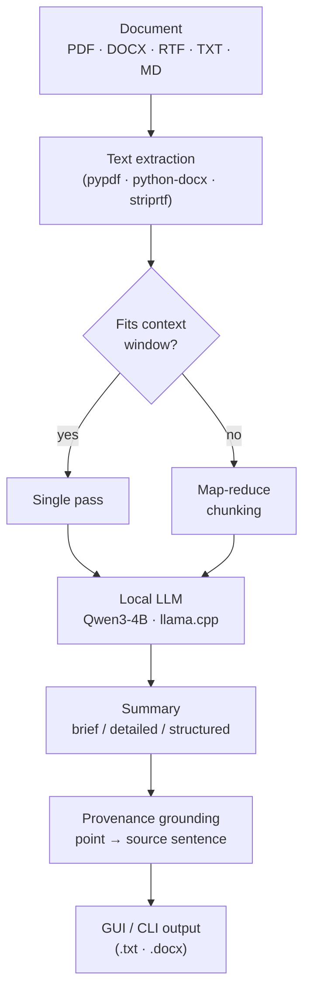

<div align="center">

# DocSummarizer

**Offline document summarization, powered by a local language model.**

Extract, chunk, and summarize academic papers and long documents entirely on your own machine — no cloud, no telemetry, no data leaving the device.

[](https://github.com/Wintersta7e/Doc-Summarizer/actions/workflows/ci.yml)
[](https://github.com/Wintersta7e/Doc-Summarizer/releases/latest)
[](https://www.python.org/)
[](#system-requirements)
[](LICENSE)
[](https://docs.astral.sh/ruff/)
[](https://mypy-lang.org/)
[](#privacy--security)


</div>

---

## Overview

DocSummarizer is a desktop application that summarizes documents with a quantized local LLM
([Qwen3 4B Instruct](https://github.com/QwenLM/Qwen3), run via [llama.cpp](https://github.com/ggerganov/llama.cpp)).
It is built for researchers who work with sensitive or unpublished material and cannot send it to a
third-party API. After a one-time model download the entire pipeline — text extraction, chunking,
inference, and provenance grounding — runs locally and air-gapped.

Long documents are handled by **map-reduce summarization** (chunk → summarize each → consolidate)
rather than truncation, so the whole document is considered. Each summary point can be traced back to
the **source sentence** it was derived from.

## Highlights

- **Fully offline & private** — no network after the model download; nothing is uploaded or logged.
- **Faithful long-document handling** — map-reduce chunking instead of a hard truncation cap.
- **Source-grounded provenance** — click a key point to highlight the sentence it came from.
- **Three summary modes** — brief, detailed (key points), and structured (Purpose / Method / Results / Conclusions).
- **Batch mode** — summarize an entire folder with live per-file status.
- **Broad format support** — PDF, DOCX, RTF, TXT, Markdown.
- **GUI and CLI** — a Qt/QML desktop console and a scriptable command line.
- **Single-file portable build** — ship one `.exe`; users install nothing.

## Architecture



| Layer | Module | Responsibility |
|-------|--------|----------------|
| UI | `ui/` (`ConsoleBridge` + QML) | Qt/QML desktop console, async orchestration |
| CLI | `cli.py` | Scriptable batch/single-file entry point |
| Parsing | `document_parser.py` | Text extraction per format |
| Inference | `model_manager.py` | Model download, chat-completion, map-reduce |
| Grounding | `provenance.py` | Summary point → source-sentence matching |

## System Requirements

| | Minimum | Recommended |
|---|---------|-------------|
| OS | Windows 10 · macOS 11 · Linux | Latest |
| RAM | 8 GB | 16 GB+ |
| Storage | 4 GB free | 8 GB free |
| CPU | 4 cores | 8+ performance cores |
| Python (from source) | 3.10 | 3.11+ |

The prebuilt executables run on the **CPU** and require no GPU. GPU acceleration is a build-from-source
option — see [Building from source](#building-from-source).

## Quick Start

### Option A — Download the portable executable (no Python required)

1. Open [Releases](https://github.com/Wintersta7e/Doc-Summarizer/releases/latest).
2. Download `DocSummarizer.exe` (Windows) or `DocSummarizer` (Linux).
3. Run it. On first launch, download the model (~2.5 GB, one-time).

### Option B — Run from source

```bash
git clone https://github.com/Wintersta7e/Doc-Summarizer.git
cd Doc-Summarizer
python -m venv .venv && . .venv/bin/activate      # Windows: .venv\Scripts\activate
pip install -e ".[gui,runtime]"
docsummarizer                                     # launch the GUI
```

## Usage

### Desktop app

1. **Drop a document** onto the window (or click **Select File**).
2. Pick a mode — **Brief**, **Detailed**, or **Structured**.
3. Press **Summarize**. In Detailed/Structured, click a point to trace it to its source.
4. **Copy** or **Save Summary** (`.txt` / `.docx`). Use **Batch** for a whole folder.

### Command line

```bash
docsummarizer-cli document.pdf                    # detailed summary to stdout
docsummarizer-cli document.pdf -t structured      # brief | detailed | structured
docsummarizer-cli document.pdf -o summary.txt     # write to a file
docsummarizer-cli ./papers/ -o ./summaries/       # batch a folder
docsummarizer-cli --download-only                 # fetch the model, then exit
docsummarizer-cli document.pdf --threads 8        # override CPU threads for this run
docsummarizer-cli document.pdf -l Chinese         # write the summary in a given language
```

### Summary modes

| Mode | Output | Best for |
|------|--------|----------|
| **Brief** | One paragraph (3–5 sentences) | A quick gist |
| **Detailed** | Lead + traceable key points | Reading comprehension |
| **Structured** | Purpose · Method · Results · Conclusions | Academic papers |

## Configuration

Settings persist in the app-data `config/` directory and survive restarts.

- **CPU threads** — defaults to half the cores. On hybrid CPUs (P+E cores), a count near the number of
  performance cores is usually fastest; raising it further can *reduce* throughput.
- **GPU offload** — disabled in the prebuilt (CPU-only) build; the toggle reflects this. Available only
  in a CUDA build from source.
- **Appearance** — System / Light / Dark, restored on launch.
- **Summary language** — `Auto` (the default) writes the summary in the document's own language;
  pick a language to pin it instead. The CLI's `-l/--language` overrides the setting for one run and
  accepts any language name, not only those the picker lists.

Model and logs are stored under the platform app-data directory
(`%LOCALAPPDATA%\DocSummarizer\` on Windows, `~/Library/Application Support/DocSummarizer/` on macOS,
`~/.local/share/DocSummarizer/` on Linux). Logs record startup, timing, and errors — **never document content**.

## Performance

Summarization is compute-bound; with map-reduce, time scales with document length. Approximate CPU
timings for the 4B Q4 model on a modern multi-core machine:

| Document | Approx. CPU time |
|----------|------------------|
| Short (1–3 pages) | ~30–90 s |
| Research paper (~10 pages) | ~2–4 min |
| Long (15+ pages) | 5 min+ |

Times depend heavily on the CPU and the prompt length per chunk. A CUDA build is several times faster.

## Building from source

```bash
pip install -e ".[gui,runtime]" pyinstaller
pyinstaller DocSummarizer.spec        # → dist/DocSummarizer[.exe]
```

The spec bundles the QML tree, fonts, and the llama-cpp libraries into one portable file.

**GPU build:** install a CUDA-enabled `llama-cpp-python` (a CUDA wheel, or build with the CUDA backend)
into the environment *before* running PyInstaller. The result is NVIDIA-only and larger, so it is kept
separate from the universal CPU release.

## Privacy & Security

- **No network** after the model download — fully air-gapped.
- **No telemetry**, no usage tracking, no document content in logs.
- **In-memory processing** — documents are not persisted by the app.
- **Open source** — auditable end to end.

## Development

Tooling is intentionally strict (broad Ruff ruleset, `mypy --strict`, pytest with a coverage floor).
See [DEVELOPMENT.md](DEVELOPMENT.md). The quality gate (matches CI):

```bash
ruff check . && ruff format --check .
mypy
pytest --cov=docsummarizer
```

## License

MIT — see [LICENSE](LICENSE).

## Acknowledgments

- [llama.cpp](https://github.com/ggerganov/llama.cpp) — efficient local LLM inference
- [Qwen3](https://github.com/QwenLM/Qwen3) — base model (Qwen3 4B Instruct)
- [Unsloth](https://huggingface.co/unsloth) — quantized GGUF distributions
- [PySide6 / Qt](https://doc.qt.io/qtforpython/) — Qt/QML desktop UI
